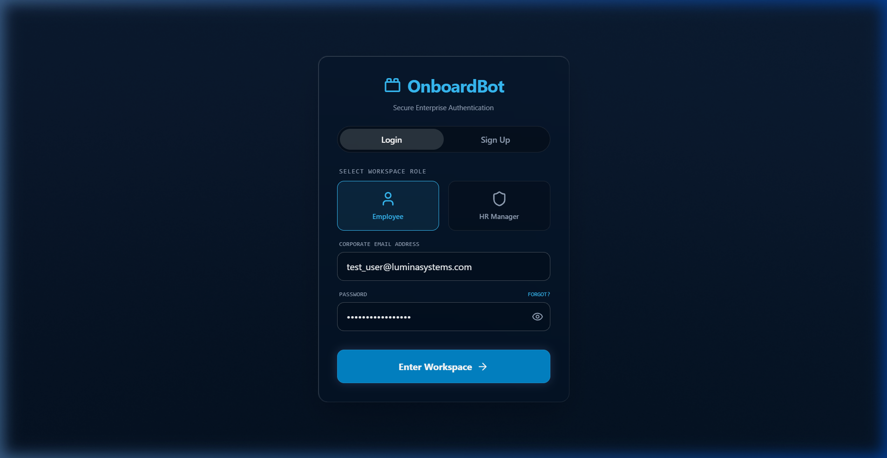
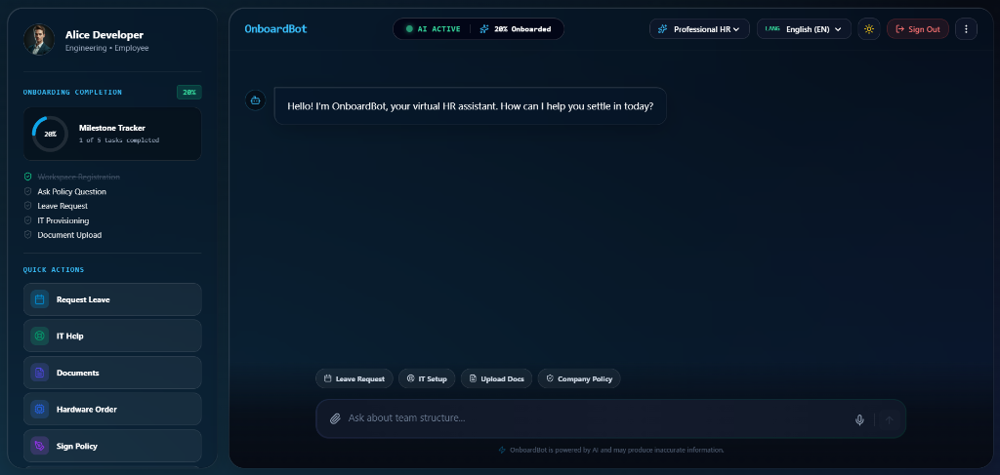
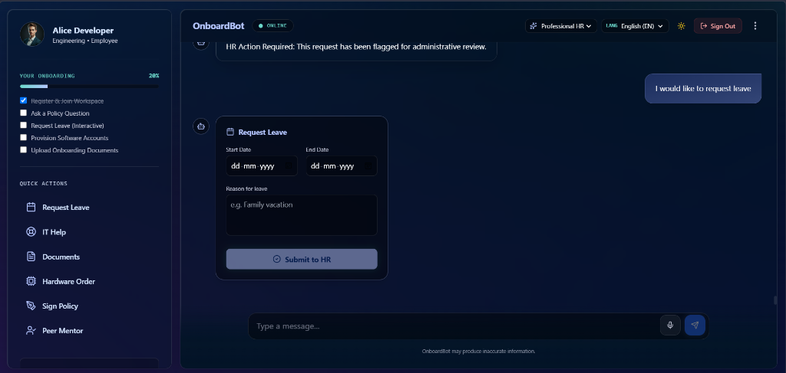
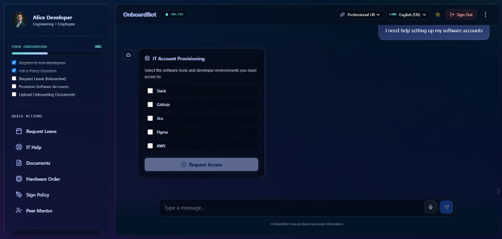
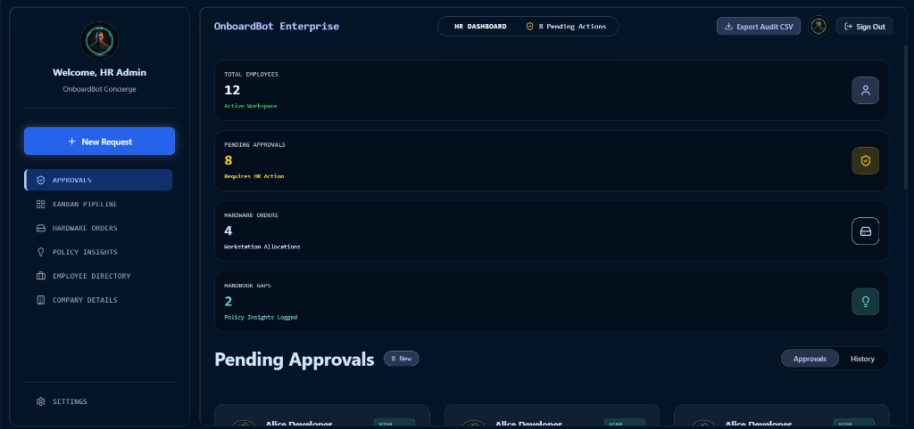
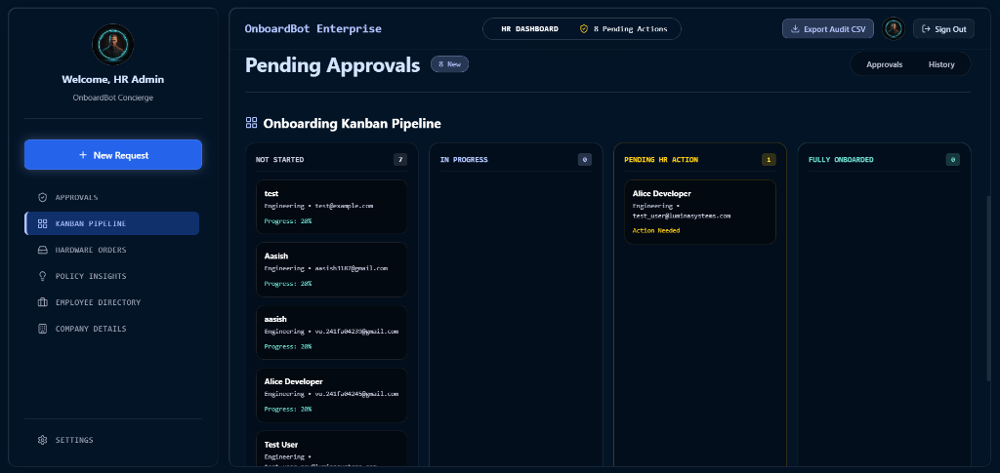

# OnboardBot -- AI-Powered Enterprise Onboarding Portal

**OnboardBot** is an intelligent, full-stack employee onboarding assistant built for modern enterprises. Powered by **FastAPI**, **React (Vite)**, **LangGraph**, and **Groq LLaMA 3.1**, it provides new hires with an AI-driven conversational experience that handles everything from HR policy questions and code reviews to leave requests and IT provisioning -- all through a premium, interactive chat interface.

> Built by **Aasish** | Lumina Systems Engineering

---

## About

OnboardBot was created to solve a critical gap in enterprise onboarding: the disconnect between new employees and the scattered systems, policies, and contacts they need to get productive. Traditional onboarding portals are static, HR teams are overwhelmed with repetitive questions, and new hires waste days navigating documentation.

OnboardBot bridges this gap by providing a single, intelligent conversational interface that:

- **Answers any work-related question** using a comprehensive enterprise knowledge base covering company policies, team structure, office maps, communication tools, benefits, and project workflows
- **Assists with code corrections and debugging**, acting as a technical mentor for new engineering hires
- **Automates HR operations** like leave requests, document uploads, IT provisioning, and hardware orders through interactive form widgets embedded directly in the chat
- **Enforces guardrails** to block personal, inappropriate, or off-topic queries while maintaining a professional workplace environment
- **Syncs in real-time** with HR administrators through WebSocket-powered live approval notifications

The system is designed with a multi-agent LangGraph architecture where a supervisor router intelligently directs queries to specialized nodes: a Knowledge RAG node for HR policies, an IT Provisioner for account setup, a General Assistant for code help and general knowledge, and a Guardrail node for content moderation.

---

## Screenshots

### Premium Glassmorphism Login


### Conversational Chat Assistant


### Interactive Leave Request Form (Widget)


### IT Provisioning Widget


### HR Admin Dashboard


### Onboarding Kanban Pipeline


---

## Key Features

### AI Assistant Capabilities
- **Full LLM Conversational Agent**: Answers any work-related question with detailed, professional responses using an 80+ line enterprise knowledge base
- **Code Correction and Debugging**: Helps new engineering hires fix code, understand Git workflows, and navigate project submission processes
- **Team and Contact Directory**: Provides team leads, email addresses, phone extensions, and department information on demand
- **Office Map and Directions**: Floor-by-floor building layout including cafeteria, gym, conference rooms, and department locations
- **Video Call and Meeting Setup**: Instructions for Google Meet, Zoom, and calendar scheduling
- **Smart Guardrails**: Blocks personal advice, offensive content, political opinions, and inappropriate requests while politely redirecting to work topics

### Interactive Widgets (In-Chat Forms)
- **Leave Request Form**: Calendar date pickers with automatic day calculation and reason field
- **IT Provisioning Form**: Checkbox selection for Slack, GitHub, Jira, VPN, and email setup
- **Document Upload Widget**: Drag-and-drop file upload for onboarding documents (ID, contracts, tax forms)
- **Hardware Order Form**: Equipment request form for laptops, monitors, peripherals, and accessories
- **Digital E-Signature Pad**: Canvas-based signature capture for NDA and policy agreements
- **Peer Buddy Pairing Card**: Displays assigned onboarding mentor with contact information

### Visual and UI Design
- **LiquidGlass UI**: iOS 26-inspired frosted glass panels with backdrop blur and subtle reflections
- **Dynamic Island Header**: Expandable capsule bar showing AI status, onboarding progress, persona selector, and language options
- **Theme Switcher**: Dark mode (deep navy mesh gradients) and Light mode (frosted white glass panels)
- **Premium Chat Input Bar**: Animated gradient border wrapper with rotating placeholder hints, quick suggestion chips, file attach button, voice input (speech-to-text), character counter, and animated send button with pulse glow
- **Ambient Mesh Backgrounds**: Animated radial gradient blobs with WebGL shader login screen
- **Micro-Animations**: Hover effects, scale transitions, fade-in-up reveals, and soundwave equalizer for voice input
- **Multi-Language Support**: English, Spanish, French, and German
- **Persona Selector**: Switch between Professional HR, Friendly, and Concise response styles

### HR Operations
- **Drag-and-Drop Kanban Board**: HR admins manage approval tickets across Pending, Approved, and Rejected columns
- **WebSocket Live Sync**: Real-time push notifications when HR approves or rejects employee requests
- **Approval Ticket System**: All leave requests, IT provisioning, and hardware orders generate trackable approval tickets
- **Chat History Persistence**: All conversations stored in SQLite database with full message history retrieval

---

## Problems Solved

1. **AI Hallucinations on Corporate Policy**: General-purpose chatbots fabricate policy details, creating compliance risks.
   - **Solution**: A strict Knowledge RAG node that answers only from a verified enterprise knowledge base. When information is not available, it directs employees to the correct HR contact instead of making up answers.

2. **Fragile Natural Language Form Extraction**: Asking chatbots to extract dates and reasons from freeform text is unreliable and error-prone.
   - **Solution**: Interactive form widgets render calendar date-pickers and structured inputs directly in the chat flow, ensuring 100% data accuracy.

3. **Over-Triggering of Action Widgets**: The original system showed Leave Request forms whenever someone mentioned "leave" or "policy", even for informational questions.
   - **Solution**: A two-stage intent detection system that uses keyword matching plus LLM confirmation to distinguish between "Tell me about leave policy" (informational) and "I want to request leave" (action).

4. **No Code or Technical Help**: Traditional onboarding bots only handle HR FAQs, leaving new engineering hires without technical guidance.
   - **Solution**: A General Assistant node that helps with code correction, debugging, Git workflows, PR reviews, CI/CD pipelines, and project submission processes.

5. **Delayed HR Approvals**: Static ticketing systems force employees to manually refresh dashboards.
   - **Solution**: WebSocket live sync pushes HR decisions (approvals/rejections) directly to the employee's chat screen in real-time.

6. **Setup Friction**: Full-stack applications require multiple terminals and manual environment activation.
   - **Solution**: A one-click `start_bot.bat` script that activates the Python virtual environment, starts the backend, launches the frontend, and opens the browser automatically.

---

## Architecture

```
                          +---------------------+
                          |   React + Vite      |
                          |   (Frontend UI)     |
                          +----------+----------+
                                     |  HTTP REST + WebSocket
                                     v
                          +----------+----------+
                          |   FastAPI Backend   |
                          |   (Auth, Chat, WS)  |
                          +----------+----------+
                                     |
                                     v
                          +----------+----------+
                          |  LangGraph Agent    |
                          |  Supervisor Router  |
                          +--+--+--+--+--+-----+
                             |  |  |  |  |
            +----------------+  |  |  |  +----------------+
            |                   |  |  |                   |
    +-------+-------+  +-------+--+--+-------+  +--------+--------+
    | Knowledge RAG |  |  IT Provisioner     |  | General Assistant|
    | (HR Policies) |  |  (Account Setup)    |  | (Code, Teams,   |
    +-------+-------+  +-------+-------------+  |  Office, Gen AI)|
            |                   |                +--------+--------+
            |                   |                         |
            |    +--------------+-----------+             |
            |    |    Guardrail Blocked     |             |
            |    | (Personal/Inappropriate) |             |
            |    +--------------+-----------+             |
            |                   |                         |
            +--------+----------+-----------+-------------+
                     |
                     v
            +--------+--------+
            | Compliance      |
            | Auditor         |
            +--------+--------+
                     |
                     v
              [Response to User]
```

### Agent Routing Logic

| User Intent | Routed To | Example |
|---|---|---|
| HR policy, leave rules, benefits | `knowledge_rag` | "What is the PTO policy?" |
| Take leave, submit documents | `knowledge_rag` (+ form widget) | "I want to request leave" |
| Set up accounts, order hardware | `it_provisioner` (+ form widget) | "Set up my Slack account" |
| Code help, team contacts, office map | `general_assistant` | "Help me fix this Python code" |
| Personal, offensive, inappropriate | `guardrail_blocked` | "Give me dating advice" |

---

## Tech Stack

| Layer | Technology |
|---|---|
| Frontend | React 18, Vite, Tailwind CSS, Lucide Icons |
| Backend | FastAPI, Uvicorn, SQLAlchemy, SQLite |
| AI/ML | LangGraph, LangChain, Groq Cloud (LLaMA 3.1-8B) |
| Security | Presidio (PII Scrubbing), python-jose (JWT), bcrypt |
| Real-time | WebSocket (FastAPI native) |
| Design | Glassmorphism, LiquidGlass UI, WebGL Shaders |

---

## File Structure

```
agnt-ai/
|
|-- frontend/                         # React Frontend Application
|   |-- public/                       # Static assets and icons
|   |-- src/
|   |   |-- components/
|   |   |   |-- ChatScreen.jsx        # Primary chat interface with widgets, sidebar,
|   |   |   |                         # dynamic island, premium input bar, and theme switcher
|   |   |   |-- LoginScreen.jsx       # WebGL shader login with glassmorphism card
|   |   |   +-- HRDashboard.jsx       # HR admin panel with Kanban board and approvals
|   |   |-- App.jsx                   # Navigation, routing, and user session wrapper
|   |   |-- index.css                 # Global styles, animations, glassmorphism utilities,
|   |   |                             # and premium input bar CSS
|   |   +-- main.jsx                  # App entry point
|   |-- tailwind.config.js            # Design tokens and custom theme specifications
|   |-- vite.config.js                # Build configuration for Vite
|   +-- package.json                  # Frontend npm dependencies
|
|-- onboardbot_v2/                    # FastAPI Backend Application
|   |-- app/
|   |   |-- api/
|   |   |   |-- auth.py               # Employee/HR registration, login, and JWT logic
|   |   |   |-- bot.py                # Chat API endpoint and database message persistence
|   |   |   +-- v1.py                 # HR approval ticketing, status, and resume routes
|   |   |-- core/
|   |   |   +-- security.py           # Password hashing, JWT tokens, PII scrubbing (Presidio)
|   |   |-- db/
|   |   |   |-- database.py           # SQLite engine and session initialization
|   |   |   +-- models.py             # SQLAlchemy models (User, ChatMessage, PendingApproval)
|   |   |-- schemas/
|   |   |   +-- payload.py            # Pydantic schemas for request/response validation
|   |   |-- services/
|   |   |   |-- agent_graph.py        # LangGraph multi-agent routing with 4 nodes:
|   |   |   |                         # knowledge_rag, it_provisioner, general_assistant,
|   |   |   |                         # guardrail_blocked + enterprise knowledge base
|   |   |   +-- websocket.py          # WebSocket connection manager for live HR approvals
|   |   +-- main.py                   # FastAPI app entry point and CORS middleware
|   |-- requirements.txt              # Python virtual env dependencies
|   |-- .env                          # Environment variables (GROQ_API_KEY)
|   +-- onboardbot.db                 # Local SQLite development database
|
|-- screenshots/                      # README screenshots
|-- start_bot.bat                     # One-click Windows startup script
+-- README.md                         # Project documentation (this file)
```

---

## Getting Started

### Prerequisites
- **Node.js** (v18+)
- **Python** (v3.10+)
- A **Groq Cloud API Key** (free at [console.groq.com](https://console.groq.com))

### Quick Start (Windows)
1. Clone the repository:
   ```bash
   git clone https://github.com/aasish3187/On-Boarding-Bot.git
   cd On-Boarding-Bot
   ```
2. Set up your `.env` file inside `onboardbot_v2/` with your Groq API key:
   ```
   GROQ_API_KEY=your_groq_api_key_here
   ```
3. Double-click the `start_bot.bat` file in the root folder.
4. The app launches automatically at `http://localhost:5173/`.

### Manual Setup

**Backend:**
```bash
cd onboardbot_v2
python -m venv venv
.\venv\Scripts\activate
pip install -r requirements.txt
uvicorn app.main:app --host 127.0.0.1 --port 8000
```

**Frontend:**
```bash
cd frontend
npm install
npm run dev
```

### Default Test Credentials
| Role | Email | Password |
|---|---|---|
| Employee | test_user@luminasystems.com | SecurePassword123 |
| HR Admin | hr_admin@luminasystems.com | HRAdmin123 |

---

## License

This project is for educational and demonstration purposes.

---

**Built with LangGraph, FastAPI, React, and Groq Cloud**
