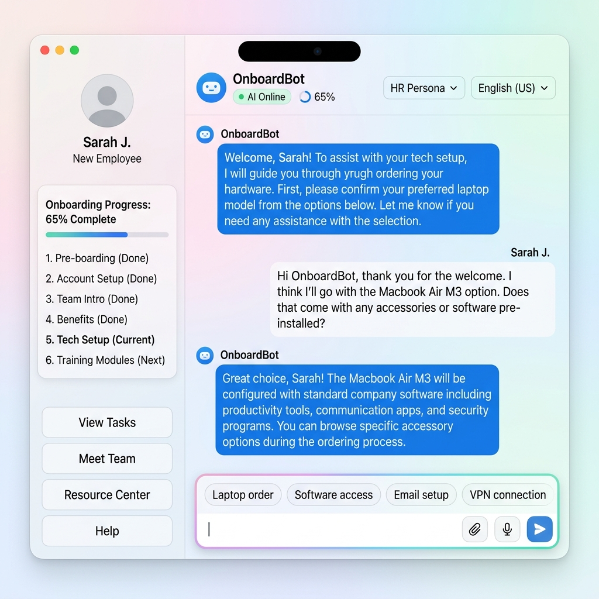

# 🤖 OnboardBot — AI-Powered Enterprise Onboarding Portal

<p align="center">
  <a href="https://on-boarding-bot.vercel.app"></a>
  <a href="https://on-boarding-bot.onrender.com/docs"></a>
</p>

<p align="center">
  
  
  
  
  
  
  
  
</p>

<p align="center">
  
  
  
  
  
  
</p>

---

**OnboardBot** is an intelligent, full-stack employee onboarding assistant built for modern enterprises. Powered by **FastAPI**, **React (Vite)**, **LangGraph**, and **Groq LLaMA 3.1**, it provides new hires with an AI-driven conversational experience that handles everything from HR policy questions and code reviews to leave requests and IT provisioning — all through a premium, interactive chat interface.

> 🏢 Built by **Aasish** | Lumina Systems Engineering  
> 🔗 **[Live Demo](https://on-boarding-bot.vercel.app)** · **[API Docs](https://on-boarding-bot.onrender.com/docs)** · **[Report Bug](https://github.com/aasish3187/On-Boarding-Bot/issues)** · **[Request Feature](https://github.com/aasish3187/On-Boarding-Bot/issues/new)**

---

## About OnboardBot

**OnboardBot** is a state-of-the-art, full-stack AI onboarding portal built to transform how modern enterprises integrate and support new hires. Traditional static employee intranets are static, siloed, and fail to provide immediate support. OnboardBot acts as an intelligent, conversational central nervous system for new employees, guiding them through administrative, technical, and operational tasks during their critical first 90 days.

---

## The Problem Statement

Onboarding a new employee in a modern software MNC involves navigating multiple friction points:

1. **Information Overload and Fragmentation**: Company policies, benefits, floor maps, and team structures are scattered across multiple tools (Confluence, Slack, PDFs, email threads). New hires waste hours looking for basic answers.
2. **HR Operations Bottleneck**: HR coordinators spend significant time responding to repetitive questions (e.g., "What is the PTO policy?") and manually processing simple workflows (e.g., booking leaves, requesting hardware).
3. **Developer Setup Friction**: New engineering hires face steep learning curves setting up local environments, understanding Git branching styles, coding standards, and project submission guidelines.
4. **Data Security and AI Hallucinations**: Standard LLM chat tools often hallucinate policy details (creating compliance/legal risks) or lack guardrails, potentially exposing sensitive corporate data or allowing inappropriate workplace discussions.
5. **Slow Approval Loops**: Traditional ticketing systems delay critical setup items (like Slack or GitHub access) due to long email loops and asynchronous checks.

---

## How OnboardBot Solves Them

OnboardBot bridges these gaps by providing an all-in-one interactive conversational interface:

- **Strict Knowledge RAG Node**: Uses a verified, enterprise-specific knowledge base to answer company policy, benefits, directory, and facility queries with zero hallucination. If a detail is missing, it points to the specific contact.
- **Developer Mentorship & MNC Workflow Assistance**: The integrated **General Assistant** node acts as a technical buddy, offering instant code review, syntax debugging, Docker troubleshooting commands, and detailed guidance on Git workflows, Agile processes, sprint structures, and code deployment schedules.
- **Interactive Inline Widgets**: Replaces fragile natural language extraction with structured forms. When a user requests leave, submits compliance docs, signs NDAs, or provisions IT accounts, interactive widgets (calendars, checklists, signature pads) pop up inside the chat to capture accurate, structured data.
- **Real-Time HR Dashboard & Live Sync**: Includes a full HR administration portal. All employee form submissions instantly generate cards on a drag-and-drop Kanban Board. Using WebSockets, approval decisions (Approved/Rejected) are pushed instantly back to the employee's chat session.
- **Safety-First Guardrails**: Implements PII scrubbing (via Presidio) to protect personal identifiers and a designated Guardrail node to filter out non-work topic requests (e.g., relationship advice, politics, medical recommendations).

---

## Screenshots

### Premium Glassmorphism Login


### Conversational Chat Assistant (Dark Mode)


### Conversational Chat Assistant (Light Mode)


### Interactive Leave Request Form (Widget)


### IT Provisioning Widget


### HR Admin Dashboard


### Onboarding Kanban Pipeline


---

## Key Features

### AI Assistant Capabilities
- **Full LLM Conversational Agent**: Answers any work-related question with detailed, professional responses using an 80+ line enterprise knowledge base
- **Code Correction and Debugging**: Helps new engineering hires fix code, understand Git workflows, and navigate project submission processes
- **Team and Contact Directory**: Provides team leads, email addresses, phone extensions, and department information on demand
- **Office Map and Directions**: Floor-by-floor building layout including cafeteria, gym, conference rooms, and department locations
- **Video Call and Meeting Setup**: Instructions for Google Meet, Zoom, and calendar scheduling
- **Smart Guardrails**: Blocks personal advice, offensive content, political opinions, and inappropriate requests while politely redirecting to work topics

### Interactive Widgets (In-Chat Forms)
- **Leave Request Form**: Calendar date pickers with automatic day calculation and reason field
- **IT Provisioning Form**: Checkbox selection for Slack, GitHub, Jira, VPN, and email setup
- **Document Upload Widget**: Drag-and-drop file upload for onboarding documents (ID, contracts, tax forms)
- **Hardware Order Form**: Equipment request form for laptops, monitors, peripherals, and accessories
- **Digital E-Signature Pad**: Canvas-based signature capture for NDA and policy agreements
- **Peer Buddy Pairing Card**: Displays assigned onboarding mentor with contact information

### Visual and UI Design
- **LiquidGlass UI**: iOS 26-inspired frosted glass panels with backdrop blur and subtle reflections
- **Dynamic Island Header**: Expandable capsule bar showing AI status, onboarding progress, persona selector, and language options
- **Theme Switcher**: Dark mode (deep navy mesh gradients) and Light mode (frosted white glass panels)
- **Premium Chat Input Bar**: Animated gradient border wrapper with rotating placeholder hints, quick suggestion chips, file attach button, voice input (speech-to-text), character counter, and animated send button with pulse glow
- **Ambient Mesh Backgrounds**: Animated radial gradient blobs with WebGL shader login screen
- **Micro-Animations**: Hover effects, scale transitions, fade-in-up reveals, and soundwave equalizer for voice input
- **Multi-Language Support**: English, Spanish, French, and German
- **Persona Selector**: Switch between Professional HR, Friendly, and Concise response styles

### HR Operations
- **Drag-and-Drop Kanban Board**: HR admins manage approval tickets across Pending, Approved, and Rejected columns
- **WebSocket Live Sync**: Real-time push notifications when HR approves or rejects employee requests
- **Approval Ticket System**: All leave requests, IT provisioning, and hardware orders generate trackable approval tickets
- **Chat History Persistence**: All conversations stored in SQLite database with full message history retrieval

---

## Problems Solved

1. **AI Hallucinations on Corporate Policy**: General-purpose chatbots fabricate policy details, creating compliance risks.
   - **Solution**: A strict Knowledge RAG node that answers only from a verified enterprise knowledge base. When information is not available, it directs employees to the correct HR contact instead of making up answers.

2. **Fragile Natural Language Form Extraction**: Asking chatbots to extract dates and reasons from freeform text is unreliable and error-prone.
   - **Solution**: Interactive form widgets render calendar date-pickers and structured inputs directly in the chat flow, ensuring 100% data accuracy.

3. **Over-Triggering of Action Widgets**: The original system showed Leave Request forms whenever someone mentioned "leave" or "policy", even for informational questions.
   - **Solution**: A two-stage intent detection system that uses keyword matching plus LLM confirmation to distinguish between "Tell me about leave policy" (informational) and "I want to request leave" (action).

4. **No Code or Technical Help**: Traditional onboarding bots only handle HR FAQs, leaving new engineering hires without technical guidance.
   - **Solution**: A General Assistant node that helps with code correction, debugging, Git workflows, PR reviews, CI/CD pipelines, and project submission processes.

5. **Delayed HR Approvals**: Static ticketing systems force employees to manually refresh dashboards.
   - **Solution**: WebSocket live sync pushes HR decisions (approvals/rejections) directly to the employee's chat screen in real-time.

6. **Setup Friction**: Full-stack applications require multiple terminals and manual environment activation.
   - **Solution**: A one-click `start_bot.bat` script that activates the Python virtual environment, starts the backend, launches the frontend, and opens the browser automatically.

---

## Architecture

```
                          +---------------------+
                          |   React + Vite      |
                          |   (Frontend UI)     |
                          +----------+----------+
                                     |  HTTP REST + WebSocket
                                     v
                          +----------+----------+
                          |   FastAPI Backend   |
                          |   (Auth, Chat, WS)  |
                          +----------+----------+
                                     |
                                     v
                          +----------+----------+
                          |  LangGraph Agent    |
                          |  Supervisor Router  |
                          +--+--+--+--+--+-----+
                             |  |  |  |  |
            +----------------+  |  |  |  +----------------+
            |                   |  |  |                   |
    +-------+-------+  +-------+--+--+-------+  +--------+--------+
    | Knowledge RAG |  |  IT Provisioner     |  | General Assistant|
    | (HR Policies) |  |  (Account Setup)    |  | (Code, Teams,   |
    +-------+-------+  +-------+-------------+  |  Office, Gen AI)|
            |                   |                +--------+--------+
            |                   |                         |
            |    +--------------+-----------+             |
            |    |    Guardrail Blocked     |             |
            |    | (Personal/Inappropriate) |             |
            |    +--------------+-----------+             |
            |                   |                         |
            +--------+----------+-----------+-------------+
                     |
                     v
            +--------+--------+
            | Compliance      |
            | Auditor         |
            +--------+--------+
                     |
                     v
              [Response to User]
```

### Agent Routing Logic

| User Intent | Routed To | Example |
|---|---|---|
| HR policy, leave rules, benefits | `knowledge_rag` | "What is the PTO policy?" |
| Take leave, submit documents | `knowledge_rag` (+ form widget) | "I want to request leave" |
| Set up accounts, order hardware | `it_provisioner` (+ form widget) | "Set up my Slack account" |
| Code help, team contacts, office map | `general_assistant` | "Help me fix this Python code" |
| Personal, offensive, inappropriate | `guardrail_blocked` | "Give me dating advice" |

---

## Tech Stack

| Layer | Technology |
|---|---|
| Frontend | React 18, Vite, Tailwind CSS, Lucide Icons |
| Backend | FastAPI, Uvicorn, SQLAlchemy, SQLite |
| AI/ML | LangGraph, LangChain, Groq Cloud (LLaMA 3.1-8B) |
| Security | Presidio (PII Scrubbing), python-jose (JWT), bcrypt |
| Real-time | WebSocket (FastAPI native) |
| Design | Glassmorphism, LiquidGlass UI, WebGL Shaders |

---

## File Structure

```
agnt-ai/
|
|-- frontend/                         # React Frontend Application
|   |-- public/                       # Static assets and icons
|   |-- src/
|   |   |-- components/
|   |   |   |-- ChatScreen.jsx        # Primary chat interface with widgets, sidebar,
|   |   |   |                         # dynamic island, premium input bar, and theme switcher
|   |   |   |-- LoginScreen.jsx       # WebGL shader login with glassmorphism card
|   |   |   +-- HRDashboard.jsx       # HR admin panel with Kanban board and approvals
|   |   |-- App.jsx                   # Navigation, routing, and user session wrapper
|   |   |-- index.css                 # Global styles, animations, glassmorphism utilities,
|   |   |                             # and premium input bar CSS
|   |   +-- main.jsx                  # App entry point
|   |-- tailwind.config.js            # Design tokens and custom theme specifications
|   |-- vite.config.js                # Build configuration for Vite
|   +-- package.json                  # Frontend npm dependencies
|
|-- onboardbot_v2/                    # FastAPI Backend Application
|   |-- app/
|   |   |-- api/
|   |   |   |-- auth.py               # Employee/HR registration, login, and JWT logic
|   |   |   |-- bot.py                # Chat API endpoint and database message persistence
|   |   |   +-- v1.py                 # HR approval ticketing, status, and resume routes
|   |   |-- core/
|   |   |   +-- security.py           # Password hashing, JWT tokens, PII scrubbing (Presidio)
|   |   |-- db/
|   |   |   |-- database.py           # SQLite engine and session initialization
|   |   |   +-- models.py             # SQLAlchemy models (User, ChatMessage, PendingApproval)
|   |   |-- schemas/
|   |   |   +-- payload.py            # Pydantic schemas for request/response validation
|   |   |-- services/
|   |   |   |-- agent_graph.py        # LangGraph multi-agent routing with 4 nodes:
|   |   |   |                         # knowledge_rag, it_provisioner, general_assistant,
|   |   |   |                         # guardrail_blocked + enterprise knowledge base
|   |   |   +-- websocket.py          # WebSocket connection manager for live HR approvals
|   |   +-- main.py                   # FastAPI app entry point and CORS middleware
|   |-- requirements.txt              # Python virtual env dependencies
|   |-- .env                          # Environment variables (GROQ_API_KEY)
|   +-- onboardbot.db                 # Local SQLite development database
|
|-- screenshots/                      # README screenshots
|-- start_bot.bat                     # One-click Windows startup script
+-- README.md                         # Project documentation (this file)
```

---

## Getting Started

### Prerequisites
- **Node.js** (v18+)
- **Python** (v3.10+)
- A **Groq Cloud API Key** (free at [console.groq.com](https://console.groq.com))

### Quick Start (Windows)
1. Clone the repository:
   ```bash
   git clone https://github.com/aasish3187/On-Boarding-Bot.git
   cd On-Boarding-Bot
   ```
2. Set up your `.env` file inside `onboardbot_v2/` with your Groq API key:
   ```
   GROQ_API_KEY=your_groq_api_key_here
   ```
3. Double-click the `start_bot.bat` file in the root folder.
4. The app launches automatically at `http://localhost:5173/`.

### Manual Setup

**Backend:**
```bash
cd onboardbot_v2
python -m venv venv
.\venv\Scripts\activate
pip install -r requirements.txt
uvicorn app.main:app --host 127.0.0.1 --port 8000
```

**Frontend:**
```bash
cd frontend
npm install
npm run dev
```

### Default Test Credentials
| Role | Email | Password |
|---|---|---|
| Employee | test_user@luminasystems.com | SecurePassword123 |
| HR Admin | hr_admin@luminasystems.com | HRAdmin123 |

---

## License

This project is licensed under the **MIT License** — see the [LICENSE](LICENSE) file for details.

[](LICENSE)

---

## Contributing

Contributions are welcome! Please read our [Contributing Guidelines](CONTRIBUTING.md) before getting started.

1. Fork the Project
2. Create your Feature Branch (`git checkout -b feature/AmazingFeature`)
3. Commit your Changes (`git commit -m 'feat: add AmazingFeature'`)
4. Push to the Branch (`git push origin feature/AmazingFeature`)
5. Open a Pull Request

---

## ⭐ Star History

If you find this project useful, please consider giving it a **star** ⭐ — it helps the project gain visibility!

[](https://star-history.com/#aasish3187/On-Boarding-Bot&Date)

---

<p align="center">
  Built with ❤️ using <b>LangGraph</b>, <b>FastAPI</b>, <b>React</b>, and <b>Groq Cloud</b>
  <br/>
  <a href="https://on-boarding-bot.vercel.app">Live Demo</a> · <a href="https://github.com/aasish3187/On-Boarding-Bot/issues">Report Bug</a> · <a href="https://github.com/aasish3187/On-Boarding-Bot/issues/new">Request Feature</a>
</p>

